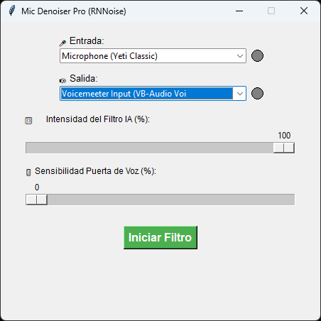

# 🎙️ Mic Denoiser Pro (IA RNNoise)

¡Adiós al ruido de fondo! Este es un filtro de micrófono en tiempo real impulsado por Inteligencia Artificial (RNNoise) y escrito en Python. Elimina el ruido de teclados, ventiladores y estática, dejando pasar únicamente tu voz de forma clara y nítida.

Ideal para usar con Discord, OBS, Twitch o cualquier juego.



---

## 🚀 Instalación desde Cero (Para principiantes)

Si nunca has programado o no tienes Python, no te preocupes. Sigue estos pasos exactos:

### 1. Instalar Python
1. Descarga Python desde su [página oficial (python.org)](https://www.python.org/downloads/).
2. Abre el instalador descargado.
3. **⚠️ PASO CRÍTICO:** En la primera pantalla que aparece, asegúrate de **MARCAR LA CASILLA** que dice **`Add python.exe to PATH`** en la parte inferior. Si no marcas esto, el programa no funcionará.
4. Haz clic en "Install Now" y espera a que termine.


### 2. Descargar este proyecto
1. Ve a la parte superior de esta página en GitHub.
2. Haz clic en el botón verde **`<> Code`** y selecciona **`Download ZIP`**.
3. Extrae esa carpeta en tu Escritorio o donde prefieras.

### 3. Instalar los "motores" del programa
Para que la Inteligencia Artificial y el audio funcionen, necesitamos instalar unas librerías gratuitas.
1. Abre la carpeta que acabas de extraer (donde está el archivo `denoiser.py`).
2. Haz clic en la barra de direcciones de la carpeta (arriba, donde dice la ruta), borra todo, escribe `cmd` y presiona **Enter**. Se abrirá una ventana negra (Terminal).
3. Escribe el siguiente comando y presiona Enter:
   ```cmd
   pip install -r requirements.txt
### 4. Espera a que termine de descargar todo. ¡Listo!

🎛️ Cómo usar el programa
En la misma carpeta, haz doble clic sobre el archivo denoiser.py (o ejecútalo desde la terminal con python denoiser.py).

En 🎤 Entrada, selecciona tu micrófono real (Ej: Blue Yeti, micrófono de los audífonos, etc.).

En 🔊 Salida, selecciona tus audífonos si solo quieres escucharte a ti mismo, o selecciona un Cable Virtual (como Voicemeeter) si quieres enviar tu voz limpia a Discord/OBS.

Presiona el botón Iniciar Filtro.

Los LEDs verdes se encenderán cuando detecten tu voz entrando y saliendo.

Explicación de los Controles Avanzados:
Intensidad del Filtro IA (%): Si lo pones al 100%, la IA limpiará todo el ruido. Si notas tu voz un poco "robótica", bájalo a 80% o 90% para mezclar un poco de tu voz natural original con la procesada.

Sensibilidad Puerta de Voz (%): Si tu habitación es muy ruidosa, sube este valor (ej. 40%). El micrófono se muteará por completo automáticamente cuando dejes de hablar, funcionando como una puerta de ruido inteligente.

🎧 Cómo conectarlo a Discord o OBS (Usando Voicemeeter)
Para que tus amigos escuchen tu voz limpia, necesitas un "Cable Virtual" que conecte la salida de este programa con la entrada de Discord. Recomendamos Voicemeeter Banana (es gratis).

Abre Voicemeeter Banana.

En tu programa Denoiser (Python), selecciona como Salida: VoiceMeeter Aux Input.

En Voicemeeter, ve a la columna del centro llamada Voicemeeter AUX y asegúrate de encender el botón > B2. Esto envía la voz al cable de salida.

[AQUÍ VA TU IMAGEN DE VOICEMEETER BANANA CON LA COLUMNA AUX Y EL BOTÓN B2 ENCENDIDO]

Abre Discord (o OBS) > Ajustes de Voz y Video.

En Dispositivo de Entrada, selecciona VoiceMeeter Aux Output.

¡Ya estás listo para transmitir con audio profesional!
